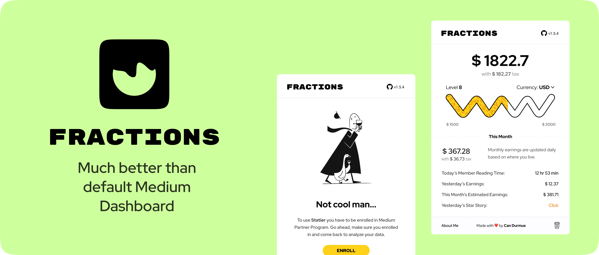
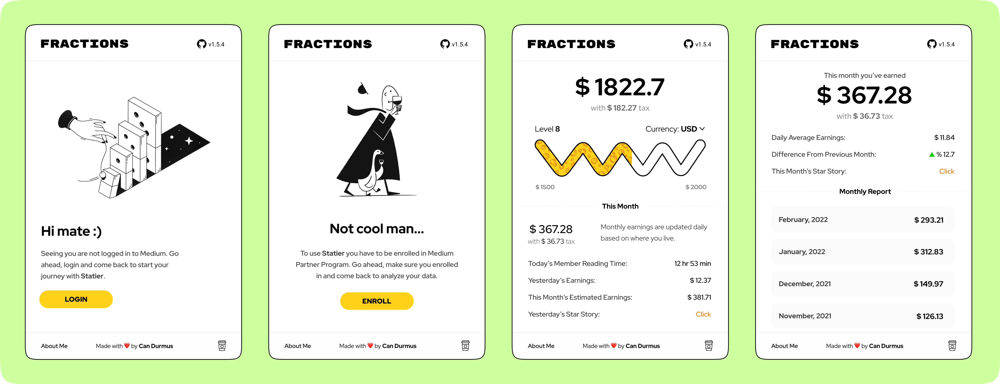

	
	
	
	
	

	
	
	

 

 

# Fractions

	

[Here](https://bettermarketing.pub/a-better-medium-partner-dashboard-fractions-c68cc211fbc1) is the blog post about it.

 

  
  

 

**Fractions** is a fully-featured Chromium | Firefox extension that helps you analyze and visualize your Medium Partner Program earnings. It is way more powerful than the default Partner Program Dashboard, Medium provides. Using this extension, you can inspect the data about your,

- lifetime earnings since you enrolled into Medium Partner Program,
- monthly earnings,
- daily total member reading time,
- yesterday's total earnings,
- yesterday's top-earning post,
- estimated earnings by the end of the month---_with a special algortihm_,
- daily average earnings,
- percent difference from the previous month,
- this month's top-earning post,
- total tax you pay,
- monthly predicted tax,
- net earnings.

 

	
	
	
	

 

---

 

### Contents

- [Why I created Fractions?](#why-i-created-fractions)
- [How is it different from Partner Dashboard?](#how-is-it-different-from-partner-dashboard)
- [Features](#features)
- [Tech Stack](#tech-stack)
- [Who am I?](#who-am-i)
- [Downloads](https://github.com/XenoverseUp/fractions/releases)
- [Future Fixes and Features](#future-fixes-and-bugs)
- [Known Issues](#known-issues)  
   

## Why I created Fractions?

Lately, I've started a blog on Medium and tried to share my programming knowledge, even though it is not so much. One day, while wandering around my MPP Dashboard, I looked up the sources (JSON) of the page and noticed there is a bulk of unusued data about almost anyhting about my page, and Medium doesn't even bother to show them to me.

So, I decided to use this data to create a browser extension for anyone who is interested. The primary concern of this extension is to show you your **net** earnings, without the taxes you have to pay. To make things interesting, I added a level system on top of stats that you can pass each level, simply by earning or writing more.

	

By the way, you might be thinking what the duck is **Fractions**? Well, it is the name of tech publication I run. Feel free to [check it out](https://medium.com/fractions), as well.

 

## How is it different from Partner Dashboard?

In Partner Dashboard, all we get is monthly and referred member earnings. There's no stat about what I earned yesterday, total member time, or the net earnings without taxes. So, I made this Chrome extension as a total replacement for Partner Dashboard. It includes everything Partner Dashboard, but adds more [features](#features) on top of them, using the data scattered around.

## Features

- Daily total member reading time
- Monthly earning estimation
- Daily earning amount (yesterday)
- Realtime currency converter
- Daily average earning
- Net earnings, calculated without taxes
- Daily top earning story
- Monthly top earning story
- Total earning
- Monthly earning report
- Earning levels
- Percent difference from previous period
- Dark Mode
- Direct links to your official Medium stats

## Tech Stack

- Vanilla JavaScript
- Python
- NodeJS
- HTML
- SASS
- Parcel
- Express

In this project, I decided to use nothing but Vanilla JavaScript for frontend. I created a kind of reactive rendering system that renders based on the current state. I fetch the data from Medium in the background and present it in the pop-up. For styling, I used SASS, since I find it more useful than plain CSS. In the end, there is Parcel bundler to build and distribute everything up. In addition, I wrote a Python script for Firefox compatibility.

Apart from extension itself, I set up a reporting server that collects the reported logs from the users so that I can track the errors and improve the **Fractions** accordingly.

## Who am I?

I am a 21-year old sophomore Electric and Electronics Engineering student in Koc University, Turkey. Besides, I am doing double major on Computer Sciences. I have a [blog](https://candurmuss.medium.com/) that I write about tech, programming and art. If you liked my work, you can [support](https://ko-fi.com/candurmuss) me.

## Future fixes and bugs

- Support for Safari
- Opera, Edge and Safari web store publishing
- Report the problem button
- Email subscriber and referred member analysis
- Partial request from backend and skeleton loading
- A better estimation algorithm

## **Known issues**

### **Slow loading time**

I tried this extension for a bunch of accounts which have roughly 450+ story, and it takes a few seconds to fetch the data. As the number of stories grow, the retrieving time also increases since I make a request for each story, separately. I'll find a way to get around this. Please try the extension and give me feedback about it.

### **Monthly estimation is not close to real**

I implemented an algortihm that approximately estimates earnings based on your previous month's data. It is just a silly algortihm for now but it'll get better gradually.

 
 

  
  

